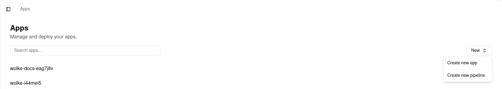
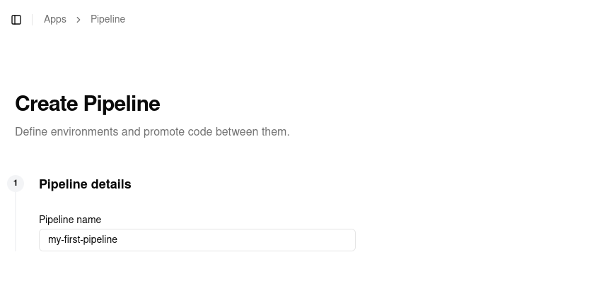
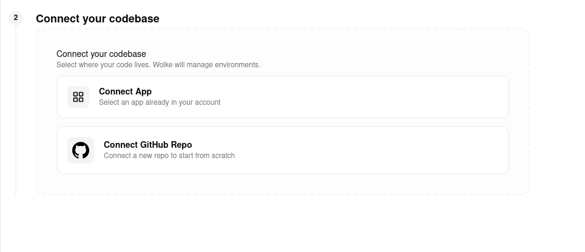
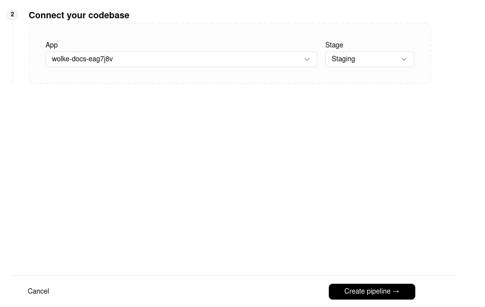
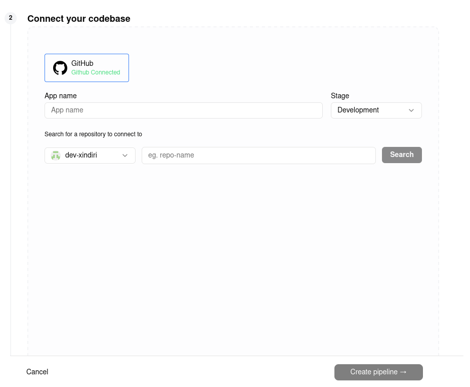

# Wolke Pipelines

## Overview

Os **Wolke Pipelines** são a solução definitiva para a gestão do ciclo de vida das suas aplicações no ecossistema `wolke.host`. Esta funcionalidade permite agregar diferentes aplicações em fluxos lógicos de entrega, proporcionando visibilidade total sobre o estado de cada serviço em diferentes estágios (Development, Staging, Production).

Com os Pipelines, a sua equipa ganha a capacidade de realizar **Promotions** (promoções de artefactos) entre ambientes com um único clique, garantindo que a mesma versão validada num estágio anterior seja a que chega ao utilizador final, eliminando erros de configuração manual e inconsistências de build.

---

## Como Criar uma Pipeline

O processo de criação é integrado diretamente no seu fluxo de trabalho atual de gestão de aplicações. Siga os passos abaixo:

### Passo 1: Aceder à Listagem de Apps

Navegue até ao menu lateral e clique em [**Apps**](https://wolke.host/apps). Aqui verá a lista de todas as suas aplicações.

### Passo 2: Iniciar a Criação

No canto superior direito da tela de listagem, localize o botão **"New"**.

- Ao clicar no botão, será exibido um menu _dropdown_.
- Selecione a opção **"Create new pipeline"**.
  

### Passo 3: Configuração da pipeline

Ao selecionar a opção, será exibido o ecrã **"Create Pipeline"**, onde deverá preencher os seguintes campos:

1. **Pipeline details:** Introduza o nome identificativo para o seu fluxo no campo **"Pipeline name"**.
   
2. **Connect your codebase:** Escolha como deseja agregar a primeira aplicação ao seu pipeline através de dois caminhos:
   
   - **Connect App (Adicionar App Existente):** Selecione uma aplicação que já esteja configurada na sua conta **wolke.host**. Ao escolher esta opção, surgirá um _select input_ para escolher a aplicação e outro para definir o seu **Stage** inicial (ex: Development, Staging ou Production).
     
   - **Connect GitHub Repo (Criar Nova App):** Escolha esta opção para conectar um novo repositório e configurar uma aplicação do zero diretamente no pipeline.
     
3. **Finalização:** Após definir o nome, a aplicação e o estágio correspondente, clique no botão **"Create pipeline"** no canto inferior direito para ativar o seu novo fluxo de trabalho.

---
